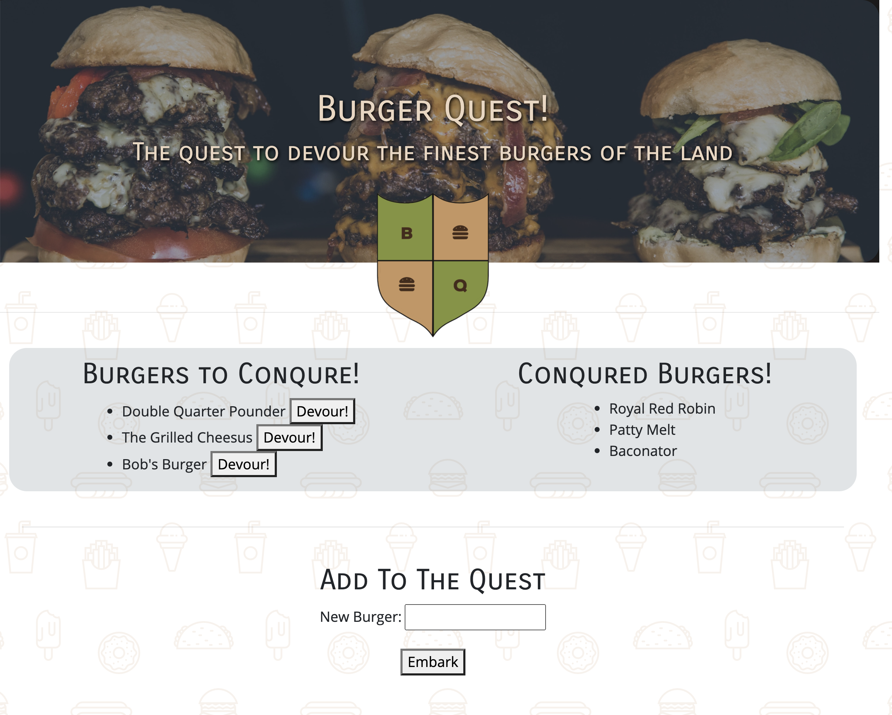

# Burger Quest 
  Burger Quest is a bugger logger that uses MySQL, Node, Express, Handlebars and a homemade ORM. The application takes in form inputs to log burger names into the database and then generates a beautiful html that lists what burgers have been eaten and yet to be eaten. 
  ## Table of Contents
  1. [Installation](#Installation)
  2. [Usage](#Usage)
  3. [Contributing](#Contributing)
  4. [Tests](#Tests)
  5. [License](#License)
  6. [Questions](#Questions)
  ## Installation
       Developers: $ npm install 
       Users: No installation required
  ## Usage
  This app is meant to be used by true burger enthusiasts who want to keep track of burgers they will want to try one day and the ones they have enjoyed already. With this app, the quest is always on to conqure more delicious burgers.  
  ## Contributing
  Commit often and comment all changes.
  ## Tests
       No test instructions. 
  ## License
  >BSD 
  ## Questions

  * GitHub: [VinAVarghese](https://github.com/VinAVarghese)
  * Email: [VinAVarghese@gmail.com](mailto:VinAVarghese@gmail.com)
  
  If you have any questions on the application, feel free to email me with the subject line: RE:BurgerQuest
  ## Links/Images
  [Click For Deployed Application](https://burgerquest-app.herokuapp.com/)

  
